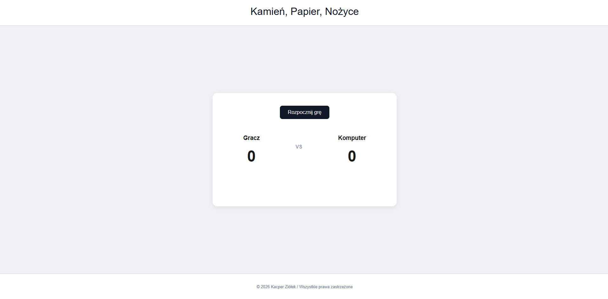

# Kamień, Papier, Nożyce 

Klasyczna minigra przeglądarkowa "Kamień, Papier, Nożyce" napisana w czystym HTML, CSS i JavaScript (bez zewnętrznych bibliotek).

Projekt skupia się na stworzeniu interaktywnego, czystego interfejsu użytkownika z responsywnym layoutem oraz prostą logiką losującą po stronie komputera.

##  Funkcje

* **Graj przeciwko komputerowi:** Komputer podejmuje w 100% losowe decyzje za pomocą `Math.random()`.
* **Dynamiczny interfejs (DOM Manipulation):** Gra płynnie przechodzi między ekranem startowym a planszą gry bez przeładowywania strony.
* **Wizualizacja wyborów:** Ekran na bieżąco pokazuje (w formie ikon SVG), jaki ruch wykonał gracz, a jaki komputer.
* **System punktacji:** Śledzenie wyników gracza i komputera w czasie rzeczywistym.
* **Kolorowe komunikaty zwrotne:** Informacja o wygranej, przegranej lub remisie z odpowiednim oznaczeniem kolorystycznym.
* **Reset gry:** Możliwość szybkiego wyzerowania licznika i powrotu do ekranu startowego.

##  Wygląd aplikacji 

| Rozgrywka |
| :---: | 
|  | 

##  Technologie

* **HTML5** (Semantyczna struktura strony)
* **CSS3** (Flexbox, animacje hover, nowoczesny design)
* **JavaScript (ES6+)** (Logika gry, obsługa zdarzeń, manipulacja DOM)

##  Struktura projektu

* `index.html` – Struktura strony i interfejsu.
* `style.css` – Arkusz stylów zapewniający nowoczesny wygląd i responsywność.
* `script.js` – Główna logika gry (nasłuchiwanie kliknięć, losowanie, liczenie punktów).
* Obrazki `.svg` – Ikony użyte do reprezentowania kamienia, papieru i nożyc.

##  Podgląd na żywo (GitHub Pages)

Możesz zagrać w grę bezpośrednio w przeglądarce, klikając w poniższy link:
**[ Zagraj w Kamień, Papier, Nożyce](https://ziollo.github.io/mini-gra/)**
